# How to add an Apple Watch Extension to your React Native application

## Introduction

SmartWatch market has grown a lot in the past few years. If you are currently developping a smartphone application you may be tempted to add an extension to this app running on a smartwatch.

In this tutorial, you will not learn how to build an apple watch app using React Native. Nevertheless, you will learn how to add a native Apple Watch extension to your existing React Native application.

You will need :

- a mac
- Xcode
- basic knowledge on React Native

You will not need :

- knowledge about how to build a native iOS/WatchOS application

## Setup

Start a new React Native project using the React Native CLI.

```bash
react-native init RNWithAppleWatch
```

Then check if the initialisation went well by running the app on an iOS device

```bash
cd RNWithAppleWatch && react-native run-ios
```

You should see this screen :
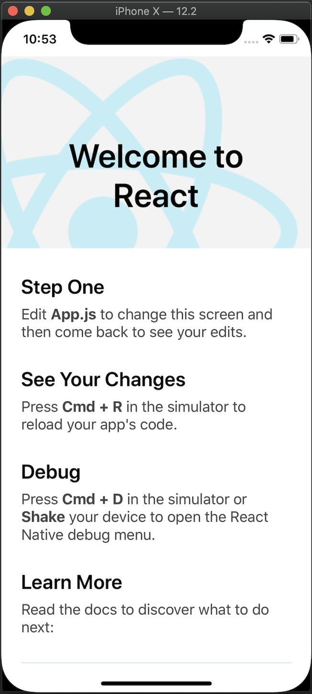

Then, open the project with your favorite text editor. We are going to modify our `app.js` file to look like this :

```js
import React, {useState} from 'react';
import {SafeAreaView, StyleSheet, TextInput, Button, Alert} from 'react-native';

const App = () => {
  const [message, setMessage] = useState('');
  const sendMessageToAppleWatch = () => {
    Alert.alert(`the message "${message}" has been sent`);
  };
  return (
    <SafeAreaView style={styles.container}>
      <TextInput
        value={message}
        onChangeText={setMessage}
        placeholder="message"
      />
      <Button onPress={sendMessageToAppleWatch} title="SEND" />
    </SafeAreaView>
  );
};

const styles = StyleSheet.create({
  container: {
    flex: 1,
    alignItems: 'center',
    justifyContent: 'center',
  },
});

export default App;
```

Now our app should look like this :

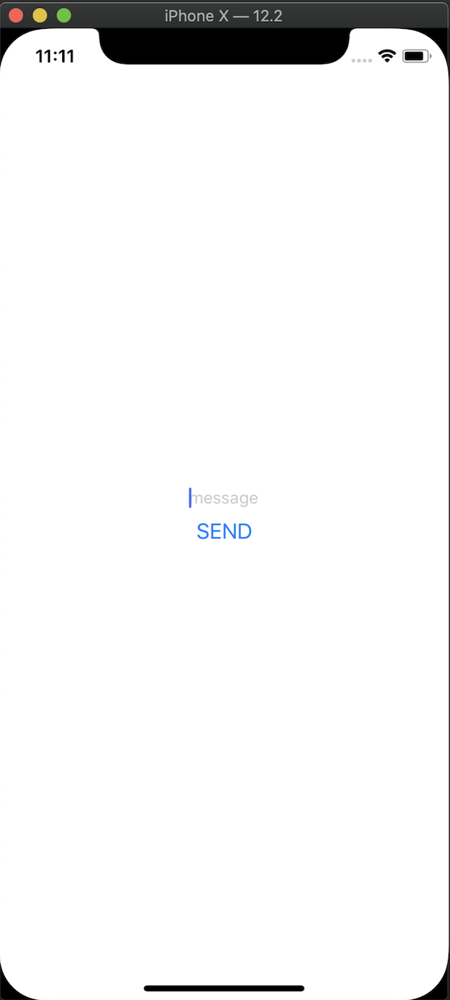

Now let the fun part begin.

## Create a Watch app

Open your the `ios` subdirectory of your react-native project using `xcode`.
On the left side of the screen :

1. select the project navigator.
2. click on your project file.

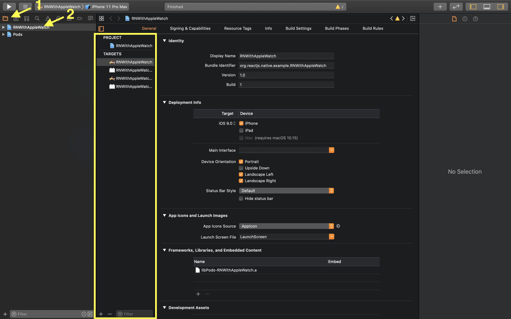

You will see the list of all the targets of your iOS application. A target defines a single product that can be build. By default we have targets for iOS and for tvOS. We are going to add a new target for WatchOS. Click on the + button at the bottom of the targets list.

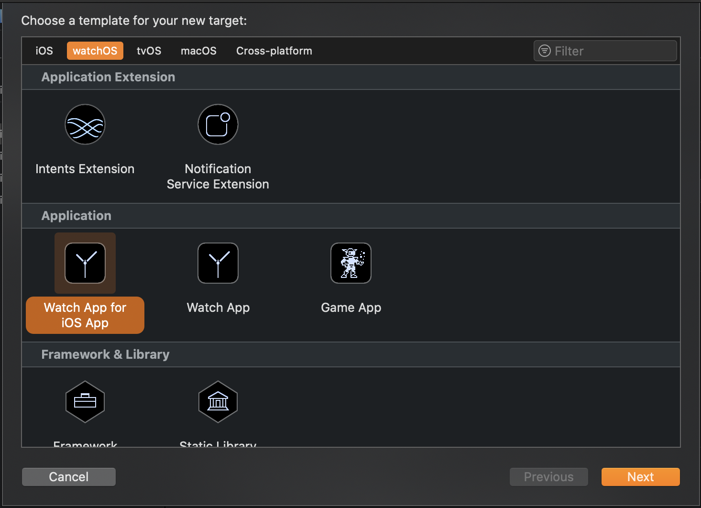

We have multiple options here. We will focus on the `Application` list. `Game App` is not what we want in this tutorial. `Watch App` will create a standalone Watch application which doesn't need a related iOS app to run. `Watch App for iOS App` will create a watch application related to an iOS application. We will select this option in our case. On the next page, you have to :

1. Set the name of your watch app
2. Set the name of your organization
3. Unselect `Include Notification Scene`

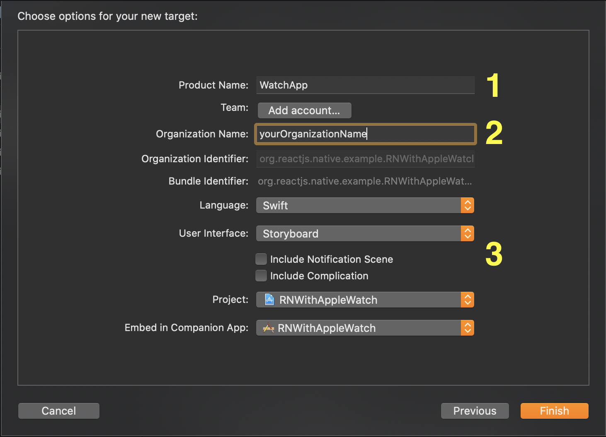

When you click on finish, a prompt will appear and ask you if you want to activate a scheme for your watch target, click on `activate`.

When you go back on your project file, you should now see two new folders `WatchApp` and `WatchApp Extension`.

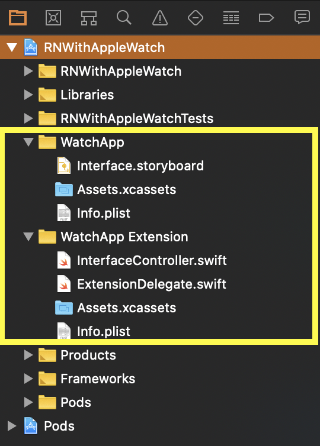
Both folders are essentials to build a watch App:

- `WatchApp` is responsible for displaying the UI. It will contain your storyboards (your Views) and your assets.
- `WatchApp Extensions` is responsible for the logic of your application. It will contain your application code.

Only the `WatchApp` target will be installed on the watch. The `WatchApp Extension` will run on the device and the data processed will be sent back to the Watch App.

At this step, you can run the generated Watch App on a Watch App simulator. In order to do so :

1. Select the WatchApp scheme.
2. Click on the build and run button.

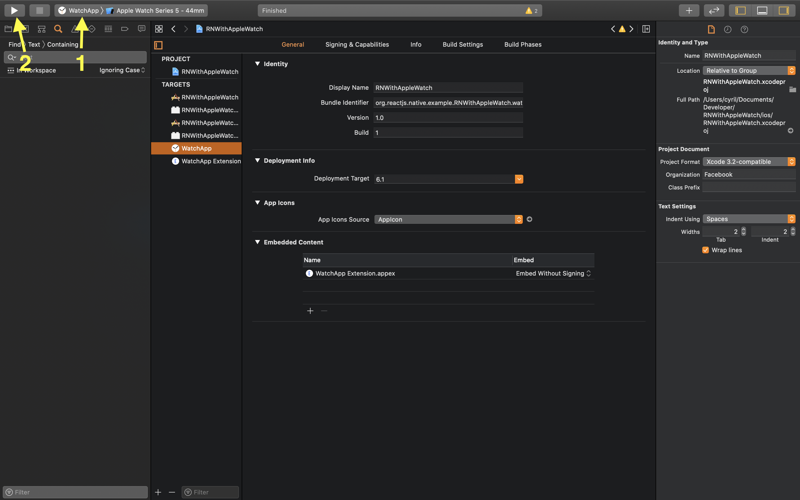

You should see a watch simulator appearing on which an empty application is running :
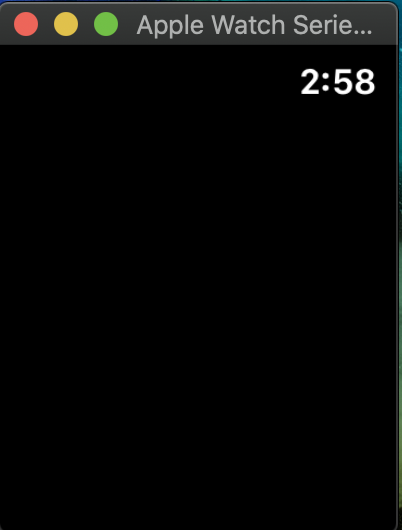

WatchOS apps are based on the `Model-View-Controller` (MVC) pattern. In order to add some graphical elements we will modify the `interface.storyboard` file (the View) inside the `WatchApp` folder. To add a new object, click on the library button at top right corner of the Xcode window.

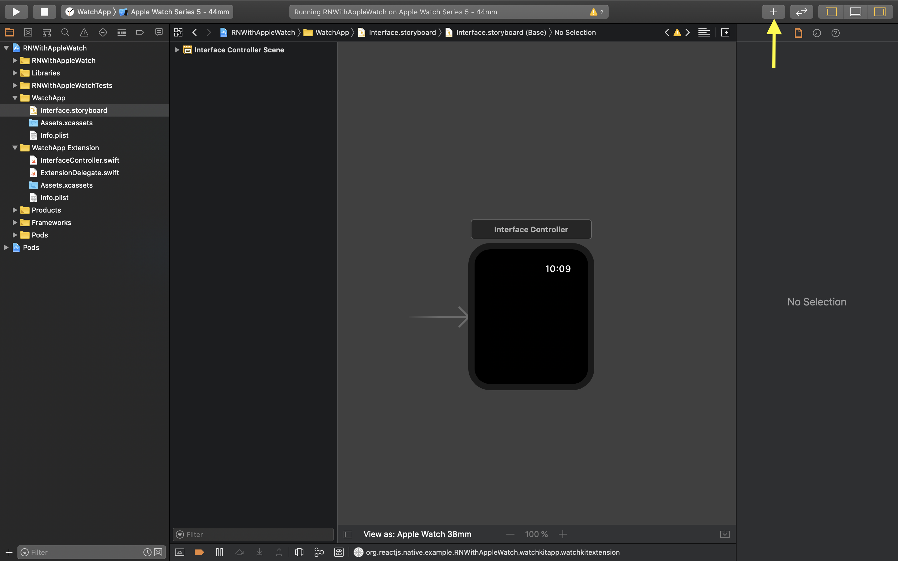

Tap `label` in the search bar to find the label object and drag and drop it in the middle of the watch two times. You should get :

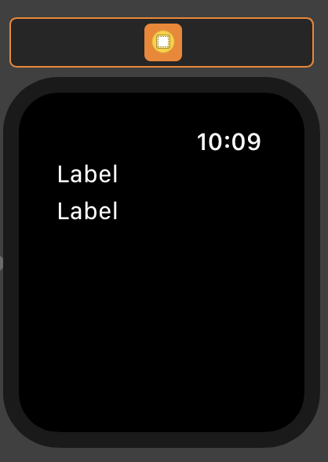

By default, the labels will be placed in the vertical direction. If you click on a label, you can modify its style and its content in the attribut inspector in the left pan of xcode.

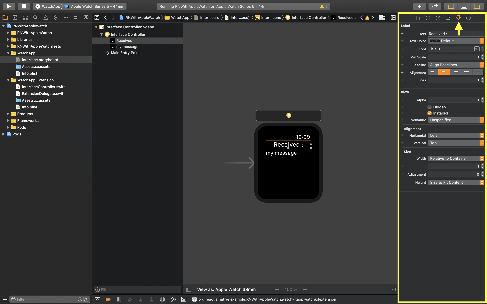

Now we have to add some logic to handle the receipt of a message from the iOS application.
To do so, open the file `interfaceController.swift` in the `WatchApp Extension` folder.
Change the content of this file with the following code :

```swift
import Foundation
import WatchKit
import WatchConnectivity

class InterfaceController: WKInterfaceController, WCSessionDelegate {
  @IBOutlet weak var textToDisplay: WKInterfaceLabel!
   var session: WCSession?

  override func awake(withContext context: Any?) {
    super.awake(withContext: context)
    if WCSession.isSupported() {
      self.session = WCSession.default
      self.session?.delegate = self
      self.session?.activate()
    }
  }

  func session(_ session: WCSession, activationDidCompleteWith activationState: WCSessionActivationState, error: Error?) {
    print("An error occured")
  }

  func session(_ session: WCSession, didReceiveMessage message: [String : Any], replyHandler: @escaping ([String : Any]) -> Void) {
    print("watch received message", message);
    let text = message["message"] as? String
    self.textToDisplay.setText(text)
  }
}
```

Our controller implements two interfaces :

- WKInterfaceController, used to control our storyboard and react to events
- WCSessionDelegate, defines methods to handle messages from the WCSession object.

The `session` variable initiate the communication between the Watch App and the iOS App.
The `textToDisplay` variable will be linked to our second label in order to display the message received from the iOS app. However it is not connected yet. You can know this by looking at the circle on the left which is empty.

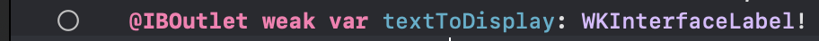

To correct this, open the `interface.storyboard` file inside the `WatchApp` folder
Above the representation of the watch, the little circle is a direct link to your controller. If you ctrl + click on it, you will be able to drag an arrow. Point this arrow to the second label and chose the outlet `textToDisplay`.

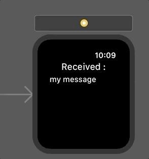

Now your storyboard and your controller can interact.
That's all for the native part ! On the next part, we will move on the react native part of the tutorial.

## Connect your React Native App with your WatchOS App

As our application is developed in React Native, we need to use a bridge to have access to the WatchConnectivity API. Fortunately, [react-native-watch-connectivity](https://github.com/mtford90/react-native-watch-connectivity) already implement all what we need. In order to install this library, run :

```bash
yarn add react-native-watch-connectivity
react-native link
```

In your `App.tsx` file replace the code of `sendMessageToAppleWatch` with the following one :

```tsx
const sendMessageToAppleWatch = () => {
  Watch.sendMessage({message}, error => {
    if (error) {
      Alert.alert(`the message "${message}" can't be sent`);
    }
  });
};
```

Restart the application. You can now send a message from the iphone simulator to the apple watch simulator !

## Conclusion

Congratulations ! You have run your first Apple Watch Application. If you want to deep dive into native development on WatchOS with swift, you will quickly be able to add more value to your React Native Application !
